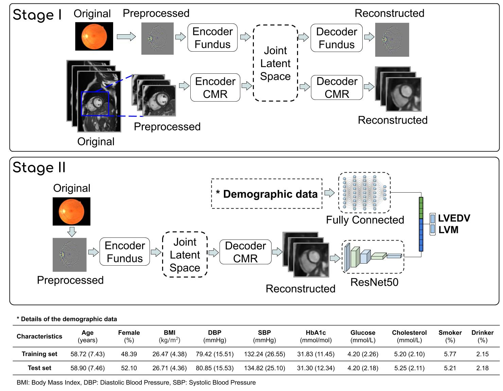
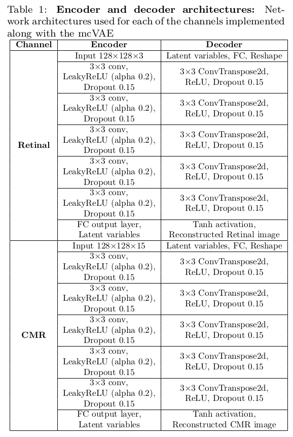

# Looking at your Heart through your Eyes: Predicting Myocardial Infarction using Retinal Images and Demographic Data

This is the project web for the study titled "Looking at your Heart through your Eyes: Predicting Myocardial Infarction using Retinal Images and Demographic Data". This is study was submitted to the journal Nature Machine Intelligence in August 2020.

----------------

## -Abstract:

Retinal images are routinely obtained in ophthalmologic practice to aid diagnosis and monitoring of both primary eye diseases and systemic conditions affecting the eye, such as diabetic retinopathy. Recent studies have shown that biomarkers on retinal images, e.g., retinal blood vessels density or tortuosity, are associated with cardiac function and may be used to identify patients at risk of coronary artery disease. In this work, we investigate the use of retinal images together with relevant patient metadata, to estimate left ventricular mass (LVM) and left ventricular end-diastolic volume (LVEDV), and subsequently, predict incident myocardial infarction. Retinal images, cardiac magnetic resonance (CMR) images and demographic data from **5663** participants in the UK Biobank cohort were used to train and validate a multi-channel variational autoencoder (mcVAE). Once trained, we were able to estimate LVM (4.4 (-32.30, 41.1) g) and LVEDV (3.02 (-53.45, 59.49) ml) based on the retinal images and demographic data. Prediction of individual risk of myocardial infarction (**AUC=0.80+/-0.02**) was performed on data for participants with only retinal images and demographic data that were not used to train our proposed method. Here we show that during routine retinal imaging, patients at high risk of future left ventricular hypertrophy and myocardial infarction could be identified.

----------------

## -Proposed Method:

We used the UK Biobank dataset [Web](https://www.ukbiobank.ac.uk/) (application # 11350) to train and validate the proposed method. Our method is based on the work published in ICML by Antelmi et al. [PDF](http://proceedings.mlr.press/v97/antelmi19a/antelmi19a.pdf).

**Schema of the proposed method:** This system is composed of two main components, a multi-channel VAE and a deep regressor network. During Stage I, a joint latent space is created with two channels: Retinal and cardiac MR. Then, during Stage II a deep regressor is trained on the reconstructed CMR plus demographic data to estimate LVM and LVEDV. **Demographic data:** Summary of the subjects metadata used in this study to train (5097 participants) and test (566 participants) the proposed method. All continuous values are reported in mean and standard deviation (in parenthesis)  while categorical data are reported in percentage.

**Encoder and Decoder Architectures:** The following are the layers used for the decoder and decoder of both channels.

----------------

## -Notes:

1. The weights of the trained model (~1.5GB) could be download from [OneDrive](http://www.cistib.org/).
2. There are several dataloaders that were used to train and test the system with retinal images, cardiac MR and bot image modalities.
3.

 
----------------
## -Reference:

Please cite the following paper if you use this code:

[1] **Diaz-Pinto A**, Attar R, Ravikumar N, Suinesiaputra A, Zhao Y, Levelt E, Dall'Armellina E, Lorenzi M, Gale C P, Gale R P, Plein S and Frangi A F. "Looking at your Heart through your Eyes: Predicting Myocardial Infarction using Retinal Images and Demographic Data". Submitted to Nature Machine Intelligence. August 2020. [[PDF]](http://www.cistib.org/)

----------------

Update log:

- 20.08.14: Code released.

